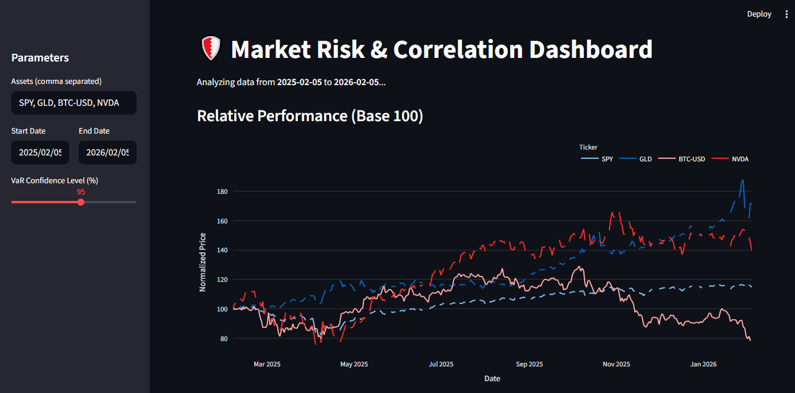

# 🛡️ Quantitative Risk & Correlation Dashboard

An institutional-grade analytics tool designed to visualize market risk and asset correlation in real-time. Built with **Python** and **Financial Engineering** principles.


## 🚀 Key Features
* **Real-Time Data Engine:** Seamless integration with `yfinance` for live market data (Stocks, Crypto, ETFs, Forex).
* **Dynamic Correlation Matrix:** Interactive heatmap using `Plotly` to identify asset coupling and diversification opportunities.
* **Parametric VaR (Value at Risk):** Calculates the maximum expected daily loss with adjustable confidence intervals (90%-99%) using statistical modeling.
* **Normalized Performance:** Base-100 comparison chart for relative strength analysis.

## 🛠️ Tech Stack
* **Core:** Python 3.9+
* **UI/UX:** Streamlit
* **Analysis:** Pandas, NumPy, SciPy (Stats)
* **Visualization:** Plotly Express
* **Deployment:** Docker

## 📦 Installation

### Option 1: Run via Docker (Recommended)
Ensure you have Docker installed, then run:
```bash
docker build -t quant-dash .
docker run -p 8501:8501 quant-dash
